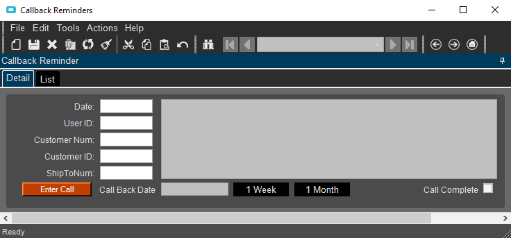

# CallBackReminder
A sales tool to record when to call customers back.  Users can review their open reminders and call back customers on the date they specified.  This customization uses a UD table.  

